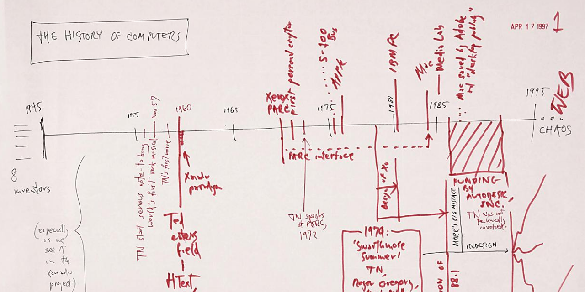

# Timeline of Hypertext Systems

This repository contains sources and scripts of a **Timeline of Hypertext Systems**.

## How does it work?

Information about Hypertext Systems is collected from sources and entered into the [Wikidata knowledge base](https://www.wikidata.org/). A SPARQL query is used to collect back the basic information from Wikidata and the information is visualized in HTML with Javascript.

## Contribution

Contributions are welcome! Please directly edit Wikidata or comment [via GitHub issues](https://github.com/nichtich/hypertext-timeline/issues)!

## See also

* [The Historic Hypertext Project](https://human.iisys.de/hist_HT/)
* http://histropedia.com/ (another application to create timelines from Wikidata)
* The image shown above is [page 1 of Ted Nelson's Workshop in new hyperstructures](https://iiif.archivelab.org/iiif/workshopinnewhyp00nels$3) (see <https://archive.org/details/workshopinnewhyp00nels/page/1>)

## Publications in Wikidata

Publications about hypertext systems should be added to Wikidata (WikiCite) for referencing and to build a bibliography. The data can best be visualized with [Scholia]. Examples:

* topic [Hypertext](https://tools.wmflabs.org/scholia/topic/Q93241)
* topic [History of Hypertext](https://tools.wmflabs.org/scholia/topic/Q5867993)
* author [Ted Nelson](https://tools.wmflabs.org/scholia/author/Q62852)
* series [ACM HT conference proceedings](https://tools.wmflabs.org/scholia/series/Q27726666)

[Scholia]: https://www.wikidata.org/wiki/Wikidata:Scholia
[hypertext system]: https://www.wikidata.org/wiki/Q65966993
